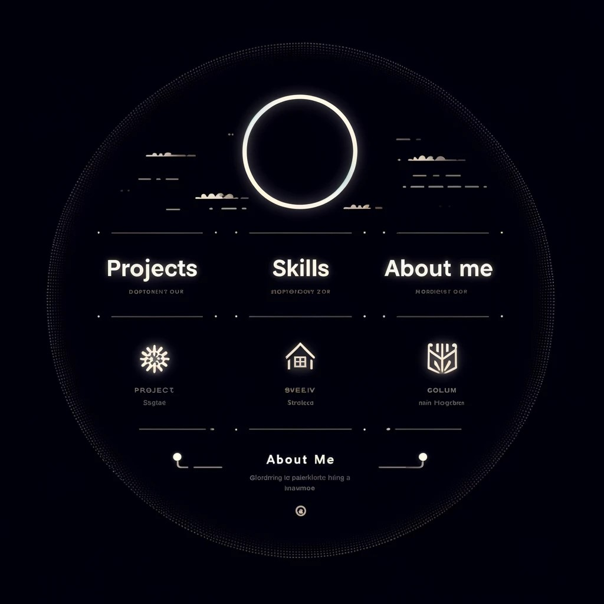

[![Contributors][contributors-shield]][contributors-url]
[![Forks][forks-shield]][forks-url]
[![Stargazers][stars-shield]][stars-url]
[![Issues][issues-shield]][issues-url]
[![License][license-shield]][license-url]
[![LinkedIn][linkedin-shield]][linkedin-url]


<!-- PROJECT LOGO -->
<br />
<p align="center">
  <a href="https://github.com/kashul/my-portfolio.git">
    
  </a>

  <h3 align="center">Customizable Portfolio
</h3>

  <p align="center">
    Sample portfolio for any profession.
  </p>
</p>


<!-- TABLE OF CONTENTS -->
<details open="open">
  <summary>Table of Contents</summary>
  <ol>
    <li>
      <a href="#about-the-project">About The Project</a>
    </li>
    <li>
      <a href="#getting-started">Getting Started</a>
      <ul>
        <li><a href="#prerequisites">Prerequisites</a></li>
        <li><a href="#installation">Installation</a></li>
      </ul>
    </li>
    <li><a href="#roadmap">Roadmap</a></li>
    <li><a href="#contributing">Contributing</a></li>
    <li><a href="#license">License</a></li>
    <li><a href="#contact">Contact</a></li>
  </ol>
</details>


<!-- ABOUT THE PROJECT -->
## About The Project

Simple portfolio website that easily customized with your details. All you need is to edit the json files in  `src\master-data` and add your details.


<p align="center">
  <a href="public/portfolio.jpg">
    
  </a>

</p>


<!-- GETTING STARTED -->
## Getting Started

Follow below instructions for setup project locally and run.
### Tech stack
* [Node.js](https://nodejs.org/en/)
* [React](https://reactjs.org/)
* [Next.js](https://nextjs.org/)
* [Talwind CSS](https://tailwindcss.com/)

### Prerequisites

Download and install Node.js [Node.js](https://nodejs.org/en/)


### Installation


1. Clone the repo
   ```sh
   git clone https://github.com/kashul/my-portfolio.git
   ```
2. Install NPM packages
   ```sh
   npm install
   ```
  
3. Build the project
   ```sh
   npm run build
   ```
4. Run the project
   ```sh
   npm run start
   ```
5. Run the project on development mode
   ```sh
   npm run dev
   ```


6. Browse [http://localhost:3000/](http://localhost:3000/)


<!-- ROADMAP -->
## Roadmap

See the [open issues][issues-url] for a list of proposed features (and known issues).


<!-- CONTRIBUTING -->
## Contributing

Contributions are what make the open source community such an amazing place to be learn, inspire, and create. Any contributions you make are **greatly appreciated**.

1. Fork the Project
2. Create your Feature Branch (`git checkout -b feature/your_branch_name`)
3. Commit your Changes (`git commit -m 'Add some changes'`)
4. Push to the Branch (`git push origin feature/your_branch_name`)
5. Open a Pull Request


<!-- LICENSE -->
## License

Distributed under the MIT License. See [LICENSE][license-url] for more information.


<!-- CONTACT -->
## Contact

Kashul - [Kashul Hindagoda][linkedin-url] - kasulkenuak@gmail.com

Project Link: [my-portfolio][project-url]


<!-- MARKDOWN LINKS & IMAGES -->
<!-- https://www.markdownguide.org/basic-syntax/#reference-style-links -->
[contributors-shield]: https://img.shields.io/github/contributors/kashul/my-portfolio?style=for-the-badge
[contributors-url]: https://github.com/kashul/my-portfolio/graphs/contributors
[forks-shield]: https://img.shields.io/github/forks/kashul/my-portfolio?style=for-the-badge
[forks-url]: https://github.com/kashul/my-portfolio/network/members
[stars-shield]: https://img.shields.io/github/stars/kashul/my-portfolio?style=for-the-badge
[stars-url]: https://github.com/kashul/my-portfolio/stargazers
[issues-shield]: https://img.shields.io/github/issues/kashul/my-portfolio?style=for-the-badge
[issues-url]: https://github.com/kashul/my-portfolio/issues
[license-shield]: https://img.shields.io/github/license/kashul/my-portfolio?style=for-the-badge
[license-url]: https://github.com/kashul/my-portfolio/blob/main/LICENSE.txt
[linkedin-shield]: https://img.shields.io/badge/-LinkedIn-black.svg?style=for-the-badge&logo=linkedin&colorB=555
[linkedin-url]: https://www.linkedin.com/in/kashul-hindagoda/
[project-url]: https://github.com/kashul/my-portfolio
